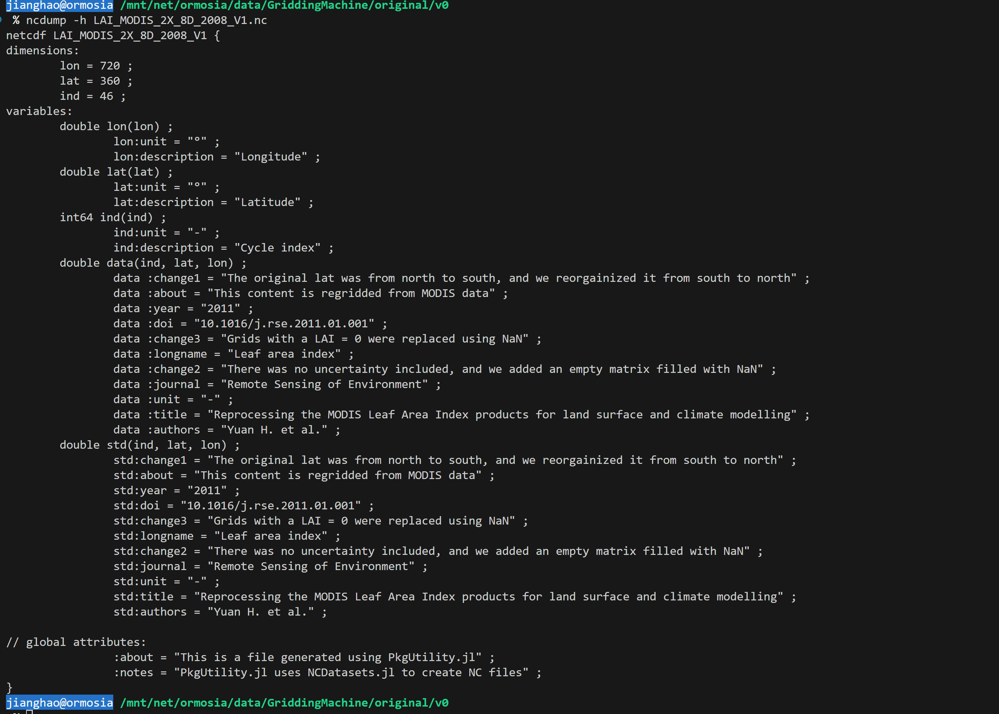
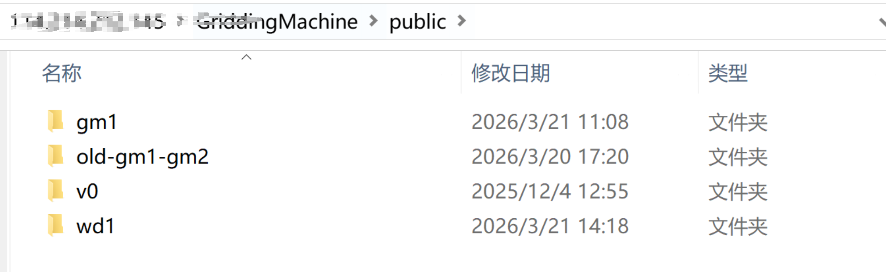
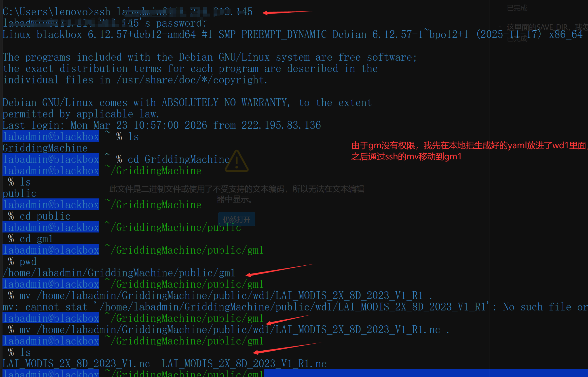
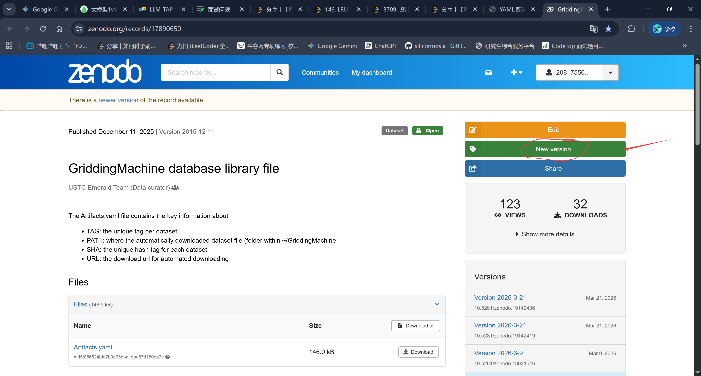
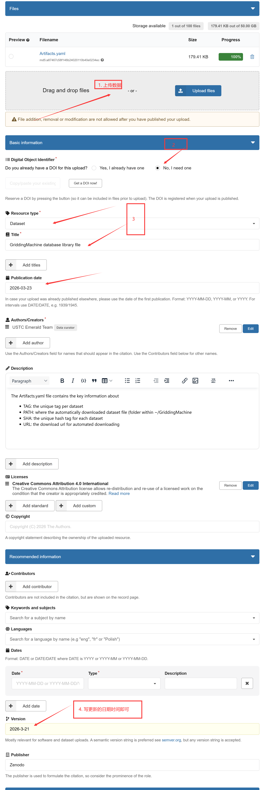
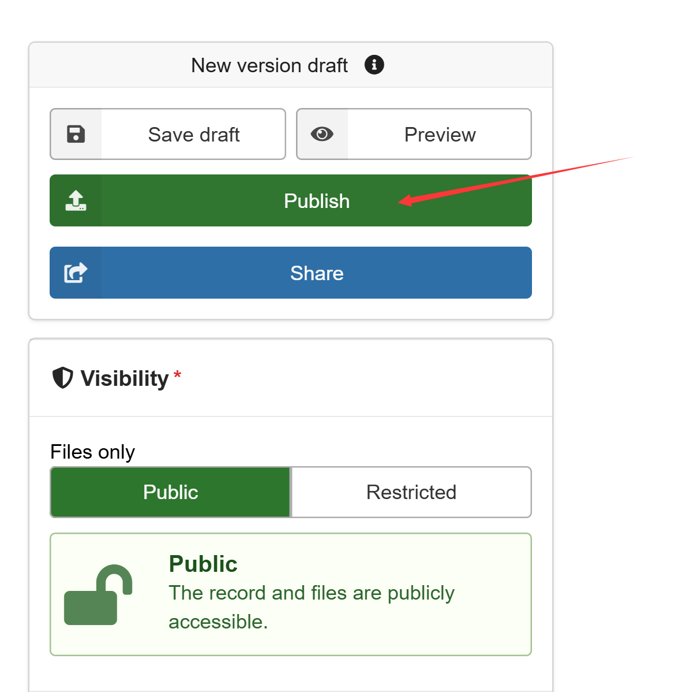

# 任务
## 一、处理原始yaml文件

### 1. 将初始nc文件放入mnt/net/ormosia/data/GriddingMachine/original/v0 目录下
---
### 2. 构建适配pipeline的yaml文件，构建在GriddingMachineDatasets仓库下面的/yaml/community/，里面有很多之前构建的yaml文件，可以参考。


#### 2.1 FILE 

```
Note that if YYYY does not exist, then it is not a duplicated task
These keys are mandatory:
    - PATTERN
    - PREFIX
    - NX
    - MT
    - VV
```
**PATTERN : "PREFIX_NX_MT_YYYY_VV.nc"，根据需求进行PREFIX、NX、MT、YYYY、VV的设置。**

**example:** 
```
FILE:
  PATTERN : "PREFIX_NX_MT_VV.nc"
  PREFIX  : ["LMA"]
  NX      : [2]
  MT      : ["1Y"]
  VV      : ["V2"]

FILE:
  PATTERN : "PREFIX_NX_MT_YYYY_VV.nc"
  PREFIX  : ["B1", "B2", "B3", "B4", "B5", "B6", "B7"]
  NX      : [1]
  MT      : ["8D", "1M"]
  YYYY    : [2000, 2001, 2002, 2003, 2004, 2005, 2006, 2007, 2008, 2009, 2010, 2011, 2012, 2013, 2014, 2015, 2016, 2017, 2018, 2019, 2020, 2021, 2022, 2023]
  VV      : ["V1"]

```


#### 2.2 FOLDER for input and output

```
FOLDER:
    ORIGINAL    :  "v0" # original data
    REPROCESSED :  "v0" # reprocessed data
```
#### 2.3 DATA -> data configuration, Note that the labels should match the PREFIX in FILE section

通过 **ncdump -h** 命令查看原始nc文件信息:



```
DATA:
  LABEL          : 这个即原始nc的数据标签比如data，["data"]
  ABOUT          : 对应nc文件信息中的dataLABEL.about、dataLABEL.doi
  GAPFILL        : 用于填充nan数据,在这里填写数字常量或者mean 
  CHANGE_LOGS    : 对应nc文件信息中的dataLABEL.change，整理成字符串数组，如：[change1, change2]
  LIMITS         : 数据限制范围，如：[0, 100]
  REV_LAT        : True 表示经纬度反向
  UNIT           : 对应nc文件信息中的dataLABEL.unit
  VERIFY_ONCE    : True 表示只验证一次
```

**example:**
```
DATA:
  ABOUT          : "CI from Wei S. et al. (2019) (https://doi.org/10.1016/j.rse.2019.111296)"
  CHANGE_LOGS    : ["The original files used GeoTIFF, and we converted it to NetCDF", "The original lat was from north to south, and we reorgainized it from south to north", "The data is regridded to 0.5 degree resolution"]
  GAPFILL        : 0
  LABEL          : ["data"]
  LIMITS         : [0, 1]
  REV_LAT        : False
  UNIT           : "-"
  VERIFY_ONCE    : True

```

#### 2.4 GRIDDINGMACHINE -> griddingmachine configuration
```
GRIDDINGMACHINE:
  TAG : 即PREFIX
  REVISION : "R1"  表示第一次更改
```
**example:**
```
GRIDDINGMACHINE:
  TAG : ELEV
  REVISION : "R1"
```


**整体example:**
```
# File name patterns
# Note that if YYYY does not exist, then it is not a duplicated task
# These keys are mandatory:
#     - PATTERN
#     - PREFIX
#     - NX
#     - MT
#     - VV
FILE:
  PATTERN : "PREFIX_NX_MT_YY_VV.nc"
  PREFIX  : ["LAI_MODIS"]
  NX      : [2]
  MT      : ["8D"]
  YYYY    : [2024]
  VV      : ["V1"]

# Folder structure for input and output
FOLDER:
  ORIGINAL    : "v0"
  REPROCESSED : "v0/lai"

# Data configuration
# Note that the labels should match the PREFIX in FILE section
DATA:
  ABOUT          : "LAI data sets for land surface and climate modelling. (2017) 10.1016/j.rse.2011.01.001"
  CHANGE_LOGS    : []
  LABEL          : ["lai"]
  GAPFILL        : 0
  LIMITS         : [0, 1]
  REV_LAT        : True
  UNIT           : "m2/m2"
  VERIFY_ONCE    : True

# GriddingMachine configuration
GRIDDINGMACHINE:
  TAG : LAI_MODIS
  REVISION : "R1"

```


---


### 3. 运行./GriddingMachineDatasets/src下面的脚本
```
    using GriddingMachineDatasets
    yaml_path = "/mnt/net/ormosia/group/jianghao/GitHub/GriddingMachineDatasets/yaml/community/CI_2X_1M_V3.yaml" # 即构建的yaml文件
    GriddingMachineDatasets.process_dataset!(yaml_path)
```

**之后新文件会生成在/mnt/net/ormosia/data/GriddingMachine/reprocessed/v0/下面，注意这个文件夹是由REPROCESSED来决定的，比如/v0/lai则是放在reprocessed/v0/lai下面**


## 二、 写入./GriddingMachineDatasets/Artifacts.yaml
其中ftp地址为：ftp://114.214.212.145/GriddingMachine/public/ 后面为自定义放置的文件位置




**exmaple：**

```
LAI_MODIS_2X_8D_2023_V1:
  PATH: "public/gm1"
  URL:
    - "ftp://114.214.212.145/GriddingMachine/public/gm1/LAI_MODIS_2X_8D_2023_V1.nc"
```

## 三、 上传更新后的Artifacts.yaml到zenodo -> https://zenodo.org/records/17890650
(1) 
(2) 
(3)  


    
   